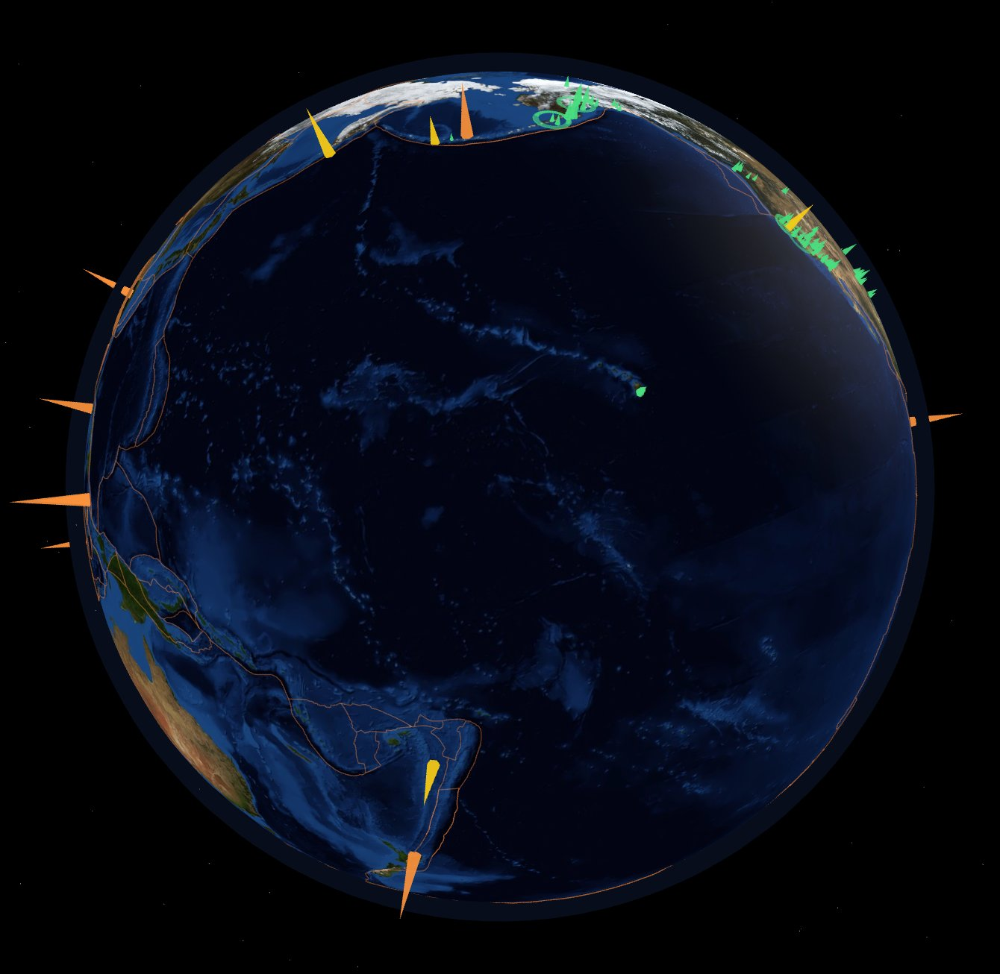
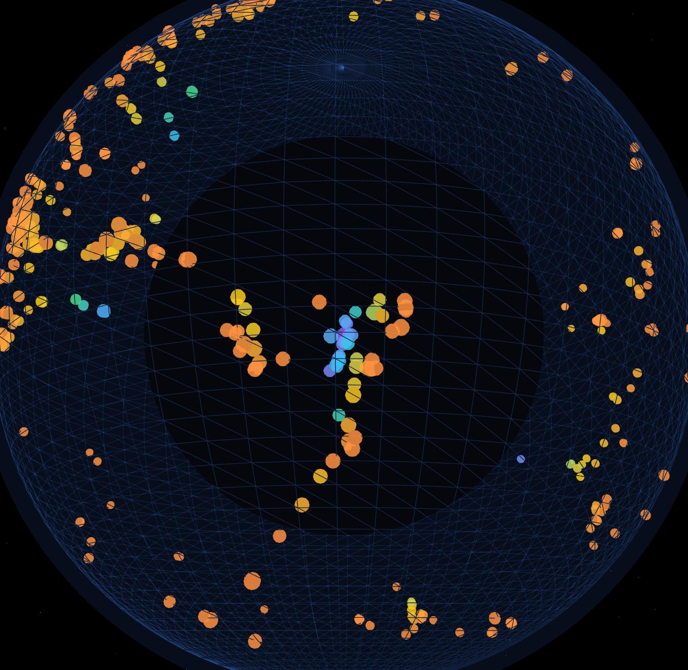
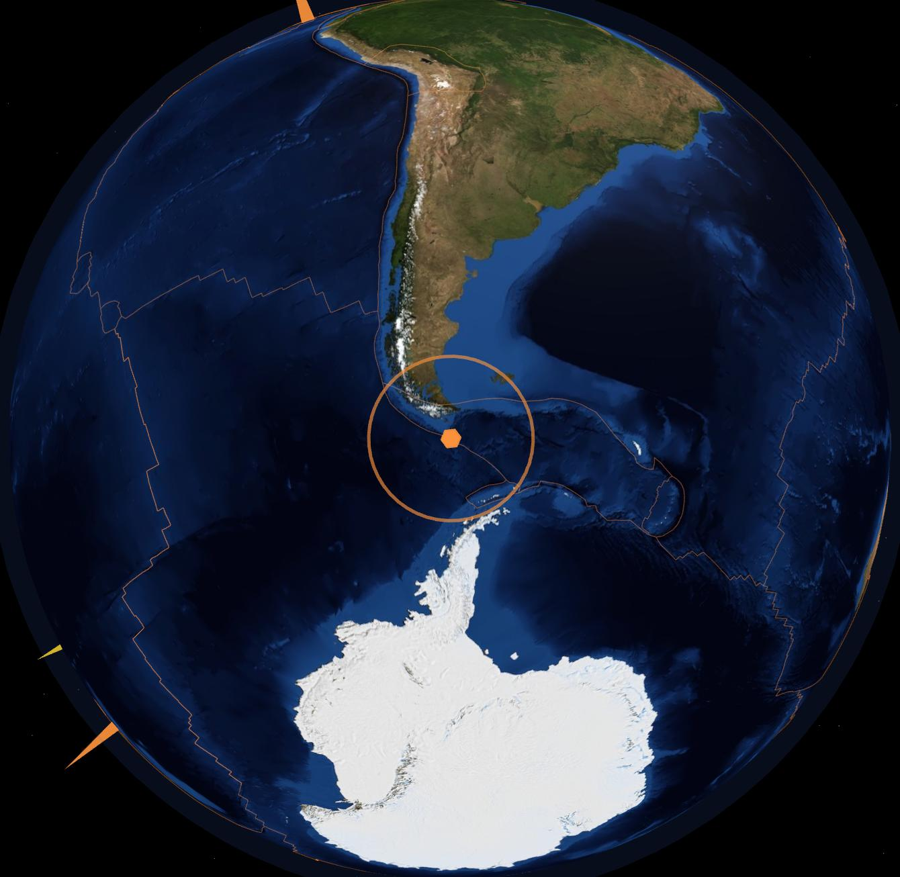

# 🌍 Quake Globe

Interactive 3D earthquake visualizer. Live USGS data rendered as
magnitude-scaled spikes on a Three.js globe — with a time scrubber, a
true-depth view that reveals subduction zones, tectonic plate boundaries,
and live updates with shockwave animations.



## Features

- **Live USGS feeds** — past hour to past 30 days (up to ~10k events),
  magnitude filter, hover tooltips, click-for-detail cards
- **Time scrubber** — replay the loaded window chronologically; quakes
  flash bright as they "occur", then settle
- **Depth view** — the globe becomes a translucent wireframe and quakes
  render *below* the surface at (exaggerated) true depth, colored by
  depth. Subduction slabs like Tonga–Fiji become clearly visible:

  

- **Tectonic plate boundaries** — toggleable overlay (Peter Bird's PB2002
  dataset, bundled at build time)
- **Live mode** — refetches every 5 minutes, diffs by event id, animates
  new arrivals with expanding shockwaves, toast notification, and an
  optional sound ping

  

- **Significant-quake sidebar** — top 10 by magnitude; click to fly the
  camera there on a smooth great-circle path
- **Mobile** — touch rotate / pinch zoom; panels collapse into a bottom sheet
- **Graceful failures** — feed retries with backoff + status banner;
  globe falls back to a plain sphere if the texture CDN is unreachable

## Running locally

```sh
npm install
npm run dev      # dev server at http://localhost:5173
npm run build    # production build in dist/
npm run preview  # serve the production build
```

Requires Node 20+. Dependencies are exactly `three` and (dev) `vite`,
pinned to exact versions.

## Architecture

Vanilla JS modules, no framework:

```
index.html          UI markup (panel, legend, timeline, sidebar, cards)
src/
  main.js           wiring: data → markers → UI, picking, events
  scene.js          renderer, camera, OrbitControls, lights, stars,
                    render loop, camera fly-to tween
  globe.js          textured globe, atmosphere, depth-mode wireframe
  markers.js        ONE InstancedMesh for all quake spikes (surface mode)
                    + one for depth spheres; raycast picking via instanceId;
                    zero-scale matrices hide filtered/not-yet-occurred quakes
  plates.js         plate boundaries as a single LineSegments draw call
  data.js           USGS GeoJSON fetch, 5-min cache, retry with backoff
  timeline.js       scrubber playback state
  live.js           5-min refresh diffing, shockwaves, WebAudio ping
  ui.js             DOM helpers: tooltip, detail card, toast, banner, sidebar
  assets/
    plate-boundaries.json   bundled PB2002 snapshot
scripts/
  fetch-plates.mjs  refreshes the bundled plate data
```

Rendering notes:

- All ~10k quakes live in a single `InstancedMesh` (5 draw calls total
  for the whole scene); comfortably 60+ fps with `all_month` loaded.
- Hover picking raycasts the instanced mesh at most once per frame;
  `instanceId` indexes straight into the quake records.
- Marker visibility (magnitude filter × timeline cutoff) is applied by
  writing zero-scale instance matrices — hidden instances are neither
  rendered nor raycast-hittable.

## Deploying

Pushing to `master` builds and deploys to GitHub Pages via
`.github/workflows/deploy.yml` (enable **Settings → Pages → Source:
GitHub Actions** once). The Vite `base` is relative, so the build works
at any path.

## Data & attribution

- Earthquake data: [USGS Earthquake Hazards Program](https://earthquake.usgs.gov/earthquakes/feed/v1.0/geojson.php)
  real-time GeoJSON feeds. Feeds are cached for 5 minutes; live mode
  polls at the same cadence the feeds regenerate.
- Plate boundaries: [fraxen/tectonicplates](https://github.com/fraxen/tectonicplates)
  (Peter Bird, *Geochemistry Geophysics Geosystems*, 2003), ODC-By licensed.
- Globe texture: NASA Blue Marble via the
  [three-globe](https://github.com/vasturiano/three-globe) example assets.
